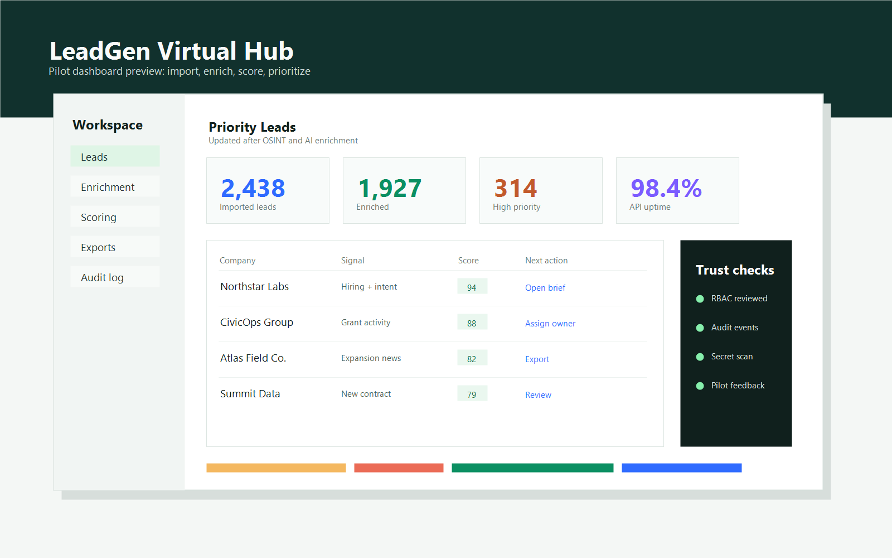
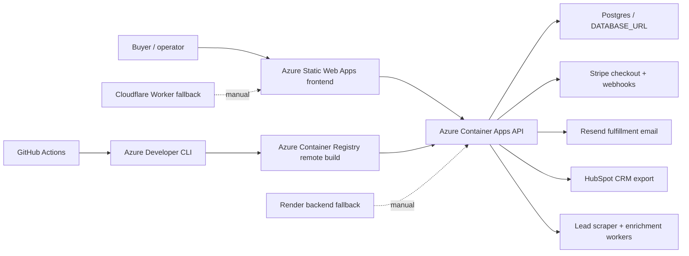

# NEXUS B2B Lead Intelligence

[](https://github.com/burkefit2382-wq/nexus-b2b-lead-generation/actions/workflows/azure-dev.yml)
[](https://github.com/burkefit2382-wq/nexus-b2b-lead-generation/actions/workflows/deploy-backend.yml)
[](https://github.com/burkefit2382-wq/nexus-b2b-lead-generation/actions/workflows/deploy-worker.yml)

NEXUS is an AI-powered B2B lead intelligence platform for collecting, enriching, scoring, packaging, and selling high-quality lead data. It combines a FastAPI backend, a TypeScript/Vite frontend, Stripe checkout, HubSpot export, Resend fulfillment, Postgres-backed membership tracking, and Azure-first deployment automation.

## Live Demo

- Production storefront: <https://nexuscloud.sh/>
- Command center dashboard: <https://nexuscloud.sh/dashboard>
- Interactive workflow demo: <https://nexuscloud.sh/workflow-demo>
- Backend health check: <https://nexuscloud.sh/api/health>

Command center preview:



Demo video status: the repository now has a dedicated evidence page and demo script in [docs/portfolio-evidence.md](docs/portfolio-evidence.md). Upload the recorded walkthrough to the issue/PR or a stable video URL, then replace this note with the final link.

## What It Builds

- Lead marketplace and checkout flow for packaged B2B data products.
- Command center dashboard for lead quality, enrichment, fulfillment, and operations.
- Worker-backed OSINT and Tampa Bay lead generation flows.
- Stripe membership checkout and webhook handling.
- HubSpot CRM export and Resend fulfillment notification paths.
- Azure Container Apps and Azure Static Web Apps deployment through GitHub Actions.
- Render and Cloudflare fallback deployment paths for resilience and edge experiments.

## Architecture



## Evidence Snapshot

Validated locally on July 16, 2026:

| Area | Result |
|---|---|
| Backend tests | `27 passed, 1 warning` in 7.23s |
| Focused app/worker coverage | 55% across `backend/app` and `backend/workers` |
| Whole backend coverage | 41% baseline including legacy `backend/server.py` |
| Frontend build | Vite production build completed in 812ms |
| Frontend bundle | `index.html` 0.41 kB, CSS 1.19 kB, JS 3.60 kB before gzip |
| Vulnerability audit | `npm --prefix frontend install` reported 0 vulnerabilities |

Reproduce the validation:

```bash
python -m pip install -r backend/requirements-dev.txt
python -m pip install coverage
PYTHONPATH=. python -m coverage run --source=backend/app,backend/workers -m pytest backend/tests
python -m coverage report -m
npm --prefix frontend install
npm --prefix frontend run build
```

## Repository Tour

- `backend/app/main.py` - FastAPI application and core product endpoints.
- `backend/app/api` - Lead and membership API modules.
- `backend/app/services` - Stripe, HubSpot, storage, database, and config services.
- `backend/workers/tampa_bay_lead_worker.py` - Lead worker pipeline and quality scoring logic.
- `backend/tests` - API, checkout, webhook, and worker quality tests.
- `backend/assets/dashboard-preview.png` - Current dashboard screenshot for the portfolio README.
- `frontend` - TypeScript/Vite frontend.
- `infra` - Azure Bicep infrastructure definitions.
- `.github/workflows` - CI/CD and deployment automation.
- `backend/docs` - API, architecture, deployment, observability, operations, roadmap, and security notes.

## Local Development

Backend:

```bash
python -m venv .venv
source .venv/bin/activate
python -m pip install -r backend/requirements-dev.txt
uvicorn backend.app.main:app --reload --host 0.0.0.0 --port 8000
```

Frontend:

```bash
cd frontend
npm install
npm run dev
```

Validation:

```bash
npm --prefix frontend run build
PYTHONPATH=. python -m pytest backend/tests
```

## Deployment

The primary production path is Azure Developer CLI through GitHub Actions. `azd up` provisions Azure Container Registry, Azure Container Apps for the backend, and Azure Static Web Apps for the frontend. Render and Cloudflare remain manual fallback/edge workflows.

Required GitHub Actions variables:

| Variable | Description |
|---|---|
| `AZURE_CLIENT_ID` | Service principal / managed identity client ID |
| `AZURE_TENANT_ID` | Azure AD tenant ID |
| `AZURE_SUBSCRIPTION_ID` | Target subscription ID |
| `AZURE_ENV_NAME` | Azure environment name, for example `nexus-dev` |
| `AZURE_LOCATION` | Azure region, for example `eastus2` |

Required secrets include Stripe, Postgres, Resend, and HubSpot credentials. See [backend/docs/deployment.md](backend/docs/deployment.md) for the full deployment path.

## Project Process

NEXUS should show visible engineering discipline:

- Open focused issues for portfolio-facing improvements.
- Use short-lived branches and clean pull requests with screenshots, test results, and performance notes.
- Keep releases tied to working product milestones.
- Keep commits scoped and descriptive, using prefixes like `feat:`, `fix:`, `docs:`, `test:`, and `ci:`.
- Track coverage and bundle size as explicit quality signals.

## Roadmap

- Record and attach a 60-90 second product walkthrough video.
- Raise focused app/worker coverage above 70%.
- Add CI-published coverage and build-size artifacts.
- Publish a release with screenshots, demo link, deployment notes, and known limitations.
- Continue moving legacy server behavior into tested FastAPI service modules.
