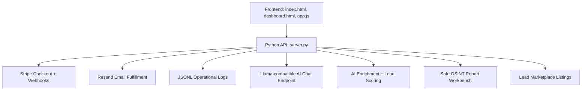

# NEXUS

AI-powered B2B lead intelligence, OSINT reporting, enrichment, scoring, and monetized lead delivery.

NEXUS is a production-ready SaaS command center for turning local market signals into sale-ready lead products. It combines a web storefront, command dashboard, scraper workflow visibility, AI enrichment, Stripe checkout, Resend fulfillment notifications, and safe OSINT report intake.

> Current public deployment: https://nexuscloud.sh

## What It Does

- Premium Tampa Bay lead packages with Stripe Checkout
- Recurring lead, OSINT, intelligence, verification, API, and agency subscriptions
- Command dashboard for revenue, fulfillment, scraper, enrichment, and AI workflow status
- AI enrichment and lead scoring endpoints for scraped lead samples
- Storefront-safe lead listings generated from enriched output
- OSINT report request workbench with safety filters and fulfillment queueing
- Stripe webhook fulfillment logging and buyer/internal Resend emails
- Static routing for Cloudflare, Render, Railway, Vercel-style, and Azure Static Web Apps style hosts

## Live Product Surface

| Area | URL |
| --- | --- |
| Storefront | https://nexuscloud.sh/#marketplace |
| Pricing | https://nexuscloud.sh/#pricing |
| Command Center | https://nexuscloud.sh/dashboard |
| Lead Market | https://nexuscloud.sh/#lead-market |
| OSINT Workbench | https://nexuscloud.sh/#osint-workbench |
| AI Chat | https://nexuscloud.sh/#ai-chat |

## Architecture



## Repository Layout

```text
.
├── index.html                 # Main storefront and app shell
├── dashboard.html             # Command center dashboard
├── app.js                     # Client routing, UI flows, checkout triggers
├── styles.css                 # Responsive product UI
├── server.py                  # Static server + API endpoints
├── main.py                    # Render entrypoint
├── tests/                     # Pytest coverage for API behavior
├── docs/                      # Architecture, API, security, deployment docs
├── .github/                   # CI and collaboration templates
├── render.yaml                # Render deployment blueprint
├── railway.json               # Railway deployment config
├── staticwebapp.config.json   # Azure Static Web Apps routing/headers
├── vercel.json                # Vercel-compatible routing/headers
├── _headers                   # Static security headers
└── _redirects                 # SPA fallback routing
```

## Local Development

```powershell
python -m pip install -r requirements.txt
python server.py
```

Open:

```text
http://127.0.0.1:4173/
http://127.0.0.1:4173/dashboard
```

## Required Environment

Copy `.env.example` and set values in your hosting provider. Keep secrets server-side.

```text
LAUNCH_HOST=0.0.0.0
PUBLIC_BASE_URL=https://nexuscloud.sh
STRIPE_SECRET_KEY=<set-in-hosting-provider>
STRIPE_WEBHOOK_SECRET=<set-in-hosting-provider>
RESEND_API_KEY=<set-in-hosting-provider>
RESEND_FROM=Nexus <sales@verified-domain.com>
WAITLIST_NOTIFY_TO=ops@example.com
LLAMA_CHAT_ENDPOINT=https://your-llama-compatible-endpoint
LLAMA_CHAT_MODEL=llama3
LLAMA_CHAT_API_KEY=<optional-hosted-model-token>
HUBSPOT_ACCESS_TOKEN=<hubspot-private-app-token>
HUBSPOT_SERVICE_KEY=<hubspot-service-key>
HUBSPOT_PORTAL_ID=246668830
```

Fallback aliases are also accepted: `HUBSPOT_SERVICE_KEY`, `HUBSPOT_PRIVATE_APP_TOKEN`, or `HUBSPOT_API_KEY`.

## Monetization Catalog

Primary live checkout lookup keys:

```text
price_starter_350
price_pro_700
price_elite_1000
price_tb_leads_10_350
price_tb_leads_25_700
price_tb_leads_50_1000
price_api_license_2000
price_api_access_500
price_scan_single_19
price_scan_pack_10_149
price_scan_pack_50_499
```

See [docs/api.md](docs/api.md) for the full API surface, [docs/deployment.md](docs/deployment.md) for launch operations, [docs/lead-benchmarking.md](docs/lead-benchmarking.md) for Apollo-vs-Nexus lead quality benchmarking, and [docs/enterprise-validation-suite.md](docs/enterprise-validation-suite.md) for load, security, and SLA validation gates.

## Quality Gates

```powershell
python -m py_compile server.py main.py
python -m pytest
python scripts\enterprise_validation_suite.py
```

The GitHub Actions workflow runs Python compile checks and pytest on every push and pull request.

## Security Posture

- Stripe and Resend secrets are never exposed to browser JavaScript.
- Stripe webhooks are signature-verified before fulfillment logging.
- OSINT workbench blocks unsafe live tracking, credential theft, and bypass requests.
- Static security headers are included for compatible hosts.
- Fulfillment logs mask buyer email in dashboard responses.

See [SECURITY.md](SECURITY.md) and [docs/security.md](docs/security.md).

## Status

NEXUS is live, checkout-enabled, and configured for continued hardening. The next enterprise milestones are multi-tenant accounts, durable database storage, RBAC, audit-log export, and SLA-backed worker orchestration.
