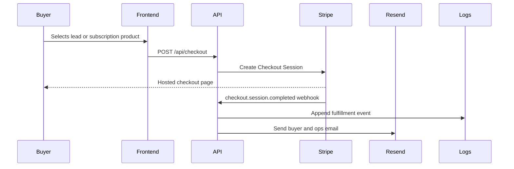

# Architecture

NEXUS is currently packaged as a Python-backed web service with a static frontend and API routes in `server.py`.

## Runtime Components

| Component | Responsibility |
| --- | --- |
| `index.html` | Storefront, pricing, marketplace, OSINT workbench, AI chat, lead workflow UI |
| `dashboard.html` | Command center and operational status surface |
| `app.js` | Client-side section routing, API calls, checkout triggers, dynamic cards |
| `server.py` | Static routing, checkout API, webhook API, enrichment, scoring, OSINT request queue |
| Stripe | Checkout Sessions, subscriptions, one-time products, webhook event source |
| Resend | Buyer confirmation and internal fulfillment notification email |
| JSONL data files | Local operational queue/log storage for waitlist, OSINT, and fulfillment events |

## Data Flow

## Enterprise Evolution

The current architecture is intentionally simple and deployable. Enterprise hardening should move operational JSONL files to PostgreSQL, add auth/RBAC, add immutable audit logs, and move long-running scraper jobs into supervised workers with retry metadata.

