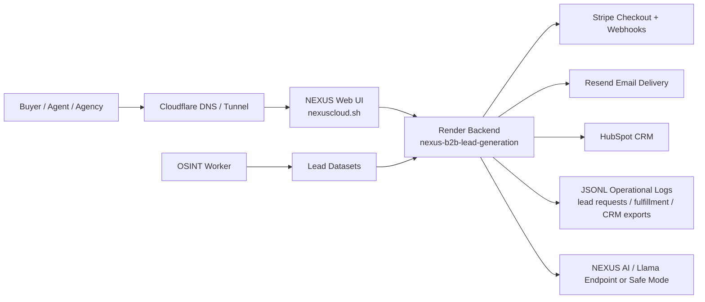

# 01 Architecture Overview

## Executive Summary

NEXUS is a hybrid AI-powered lead intelligence SaaS that combines public-source lead discovery, scoring, enrichment, storefront packaging, Stripe checkout, Resend email delivery, HubSpot CRM export, Cloudflare routing, and Render-hosted backend services.

The production system currently runs primarily through Render, with Cloudflare routing the public domain to the Render backend. A Cloudflare Worker/static asset build also exists as an optional frontend deployment surface.

## High-Level Architecture

## Core Components

| Component | Current Role | Production Status |
| --- | --- | --- |
| `launch_site/` | Main command center, storefront, dashboard, API routes | Active source surface |
| Render service `nexus-b2b-lead-generation` | Production web backend | Live |
| Render service `nexus-tracking-api` | Tracking/FastAPI support API | Live |
| Render worker `nexus-osint-worker` | Background lead/OSINT worker | Live service configured |
| Cloudflare Tunnel | Routes `nexuscloud.sh` to Render backend | Active in current Windows session |
| Resend | Buyer/admin email notifications | Configured |
| Stripe | Checkout sessions and webhooks | Configured |
| HubSpot | CRM contact export and status endpoints | Endpoint implemented; token must be valid |
| GitHub Actions | CI, packaging, security checks, deploy hook workflow | Present |
| Cloudflare Worker | Static frontend asset worker | Build validates; deploy requires token |

## Application Surfaces

| Surface | Purpose |
| --- | --- |
| `/` | Main storefront and command-center landing surface |
| `/dashboard` | Operational dashboard, fulfillment status, test transaction audit |
| `/#lead-market` | Public lead package marketplace |
| `/#pricing` | SaaS pricing tiers |
| `/#marketplace` | Scan/report/intelligence products |
| `/lead-control-center` | Operator control center for delivery, CRM, email, and lead ops |

## Current Production Pattern

1. User visits `https://nexuscloud.sh`.
2. Cloudflare routes traffic to the Render backend.
3. Render serves the web UI and API endpoints.
4. Stripe handles payment checkout and sends webhooks back to `/api/stripe-webhook`.
5. Backend records fulfillment events and calls Resend when configured.
6. CRM export endpoints upsert leads to HubSpot when a valid CRM token is configured.
7. Dashboard surfaces system status, fulfillment status, and lead operations.

## Enterprise Hardening Priorities

| Priority | Item |
| --- | --- |
| 1 | Move operational JSONL files to durable database storage |
| 2 | Add operator authentication and role-based dashboard access |
| 3 | Make Cloudflare origin permanent through DNS/Worker/Render custom domain instead of a session-bound local tunnel process |
| 4 | Add centralized logging and alerting |
| 5 | Add audit logs for admin actions, CRM exports, fulfillment events, and data access |
| 6 | Finalize legal policies, DPA, privacy policy, and retention policy |
