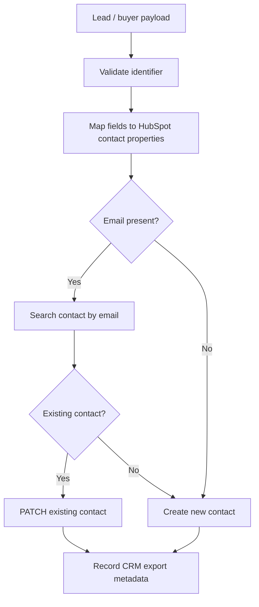
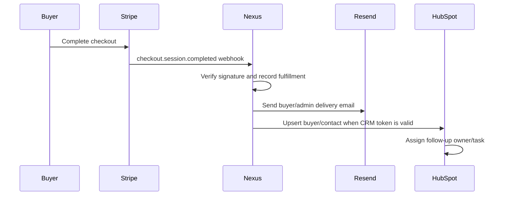

# 04 CRM Integration Documentation

## CRM Objective

NEXUS uses CRM integration to move qualified buyer leads, customer requests, and enriched prospects into HubSpot for follow-up, task assignment, subscription tracking, and customer lifecycle management.

## Current CRM Provider

```text
HubSpot Portal ID: 246668830
Primary API: https://api.hubapi.com/crm/v3/objects/contacts
```

## Backend Endpoints

| Endpoint | Method | Purpose |
| --- | --- | --- |
| `/api/hubspot-status` | GET | Check CRM configuration |
| `/api/crm-status` | GET | Alias for CRM status |
| `/api/hubspot-export` | POST | Upsert a contact into HubSpot |
| `/api/crm-export` | POST | Alias for contact export |

## Supported Token Variables

The backend checks these names in order:

```text
HUBSPOT_ACCESS_TOKEN
HUBSPOT_SERVICE_KEY
HUBSPOT_PRIVATE_APP_TOKEN
HUBSPOT_API_KEY
```

Recommended production variable:

```text
HUBSPOT_ACCESS_TOKEN
```

## CRM Sync Logic



## Contact Field Mapping

| NEXUS Field | HubSpot Property |
| --- | --- |
| `email` | `email` |
| `contactName`, `name` | `firstname` / `lastname` where possible |
| `company` | `company` |
| `phone` | `phone` |
| `website` | `website` |
| `city` | `city` |
| `state` | `state` |
| `postcode` | `zip` |

## Customer Onboarding Flow

1. Buyer visits storefront.
2. Buyer selects lead package, scan/report product, or subscription offer.
3. Stripe Checkout collects payment.
4. Stripe webhook creates a fulfillment record.
5. Resend sends buyer confirmation and internal notification.
6. Operator reviews inventory/product scope.
7. CRM export creates/updates buyer contact.
8. HubSpot owner creates follow-up task and delivery notes.

## Lead Delivery Flow



## Subscription Activation

Subscription products should create a CRM lifecycle event with:

- Product/package purchased
- Stripe customer ID
- Stripe subscription ID where available
- Lead quantity or scan/report entitlement
- Delivery SLA
- Renewal date
- Account owner

## Email Automation

Current email provider:

```text
Resend
```

Recommended automated emails:

| Trigger | Recipient | Message |
| --- | --- | --- |
| Checkout complete | Buyer | Confirmation and next-step delivery expectation |
| Checkout complete | Operator | Fulfillment task and package metadata |
| Lead package delivered | Buyer | Delivery confirmation |
| Subscription renewal | Buyer/operator | Renewal and fulfillment reminder |
| CRM export failed | Operator | Manual CRM recovery task |

## CRM Launch Gates

- Confirm HubSpot token returns `configured: true`.
- Test one dummy CRM export.
- Confirm contact appears in HubSpot.
- Confirm no API token is exposed in browser code.
- Add CRM task creation/workflow automation.
- Add durable CRM export logs outside local JSONL for production.
