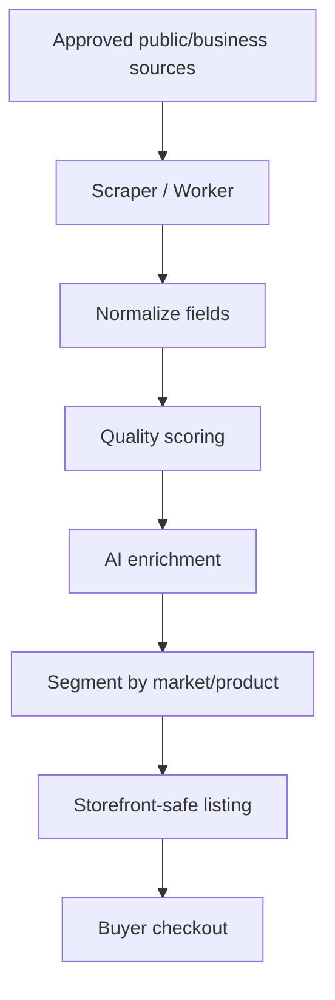
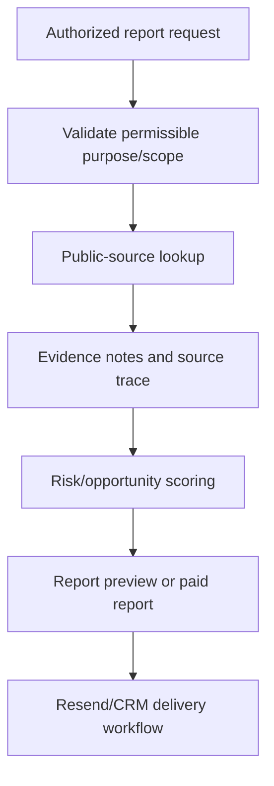
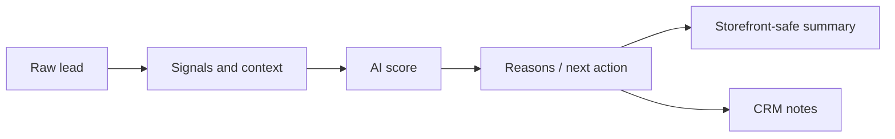

# 06 Data Flow Documentation

## Overview

NEXUS converts public-source and operator-approved lead data into enriched, scored, buyer-ready intelligence products. The main flows are LeadGen, OSINT/reporting, real estate vertical targeting, AI enrichment, storefront publication, checkout, fulfillment, and CRM follow-up.

## LeadGen Pipeline

Key fields:

- Company/business name
- Category/vertical
- City/county/state
- Website
- Phone when available
- Address/geo fields when available
- Source evidence
- Score and score notes

## OSINT Pipeline

Guardrails:

- Do not bypass platform access controls.
- Do not collect private credentials, private messages, or protected account content.
- Do not publish raw sensitive personal data to storefront pages.
- Use report products only for lawful, authorized business intelligence and lead intelligence purposes.

## Real Estate Pipeline

Target verticals:

- Residential real estate agents
- Real estate brokerages
- Mortgage brokers
- Property-related businesses
- Home/professional cleaning targets
- Tampa Bay county-focused campaigns

Flow:

1. Define territory: Pinellas, Hillsborough, Pasco, Hernando, and nearby Tampa Bay markets.
2. Filter invalid/out-of-scope regions.
3. Prioritize high score records.
4. Enrich missing contact fields where lawful and available.
5. Segment real estate vs mortgage vs home services.
6. Package into pilot packs or subscriptions.

## AI Enrichment Pipeline

AI enrichment output should include:

- Score
- Score band
- Confidence
- Why it matters
- Suggested outreach angle
- Buyer/seller/referral segment
- Missing data notes
- Compliance/safety notes

## Report Generation

Report products:

- People/business/property reports where lawful and authorized
- Digital footprint summaries
- Lead intelligence reports
- Opportunity score reports
- Business intelligence reports

Recommended report contents:

- Executive summary
- Lead/contact/account context
- Source notes
- Score and rationale
- Opportunity/risk analysis
- Recommended outreach angle
- Data quality caveats

## Storefront Publication

Public storefront listings should expose:

- Product name
- Territory
- Quantity
- Price
- Delivery terms
- Aggregate quality description
- Privacy-safe summary

Public storefront listings should not expose:

- Raw personal phone/email lists before purchase/review
- Sensitive identifiers
- Unverified private data
- Claims of conversion performance without measured evidence

## Fulfillment Flow

1. Buyer completes Stripe Checkout.
2. Stripe sends signed webhook.
3. Backend records fulfillment event.
4. Resend sends confirmation/admin alert.
5. Operator reviews package and inventory.
6. Lead pack/report is delivered.
7. CRM contact/task is updated.
8. Dashboard reflects delivery status.
