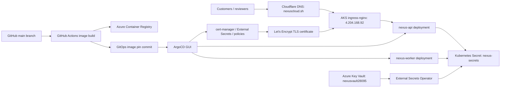

# Architecture Diagram

## Deployment Boundary

All production workload and platform changes flow through Git and ArgoCD. The emergency rollback procedure allows direct Kubernetes rollback only as a break-glass action, followed by a Git reconciliation.
